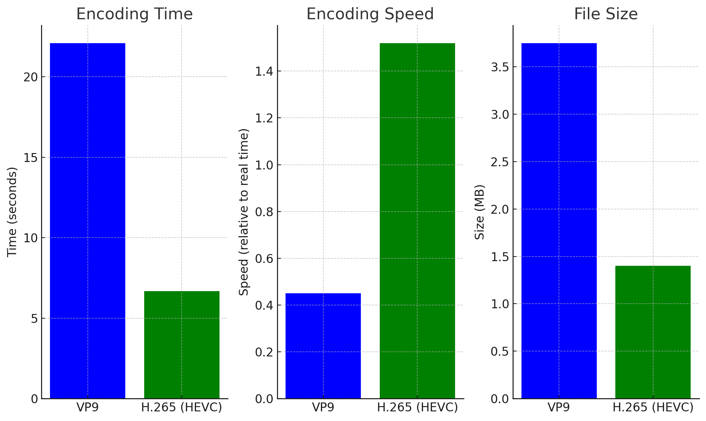
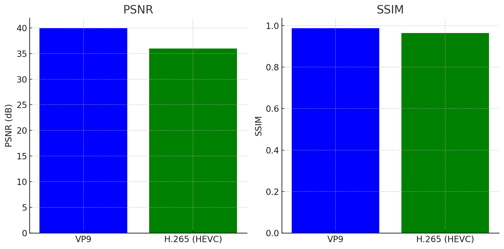

# README

## Research Task: Audio and Video Codecs

### Overview

This research project focuses on the comprehensive analysis and comparison of different audio and video codecs. The primary objectives are to explore various algorithms and methods used in these codecs, understand the theoretical aspects of audio and video encoding, and implement and compare encoding techniques using Java.

### Objectives

1. **Audio and Video Codecs Research**:
   - Investigate various audio and video codecs, their functionality, and their use cases.
   - Understand the underlying principles and technologies behind popular codecs such as VP9, H.265 (HEVC), and others.

2. **Comparison Algorithms and Methods**:
   - Compare the performance, efficiency, and quality of different audio and video codecs.
   - Analyze the encoding and decoding algorithms used in these codecs.
   - Evaluate the strengths and weaknesses of each codec in various scenarios.

3. **Theory Knowledge in Audio and Video Encoding**:
   - Study the theoretical aspects of audio and video encoding, including compression techniques, bitrates, and quality metrics.
   - Explore the mathematical foundations and signal processing techniques used in encoding.

4. **Java Research and Metrics Comparison**:
   - Implement audio and video encoding techniques in Java.
   - Compare the performance and quality metrics of different codecs using Java-based implementations.
   - Analyze the results using metrics such as PSNR, SSIM, encoding time, and file size.

### Structure

#### 1. Audio and Video Codecs Research
- **Documents**: Research papers, articles, and documentation on various codecs.
- **Analysis**: Detailed analysis of codec architectures, features, and use cases.

#### 2. Comparison Algorithms and Methods
- **Algorithms**: Description and comparison of encoding and decoding algorithms.
- **Methods**: Evaluation methods and criteria for comparing codecs.
- **Results**: Summary of findings and comparative analysis.

#### 3. Theory Knowledge in Audio and Video Encoding
- **Theoretical Concepts**: Explanation of key concepts such as compression, bitrates, and quality metrics.
- **Mathematical Foundations**: Detailed study of the mathematical principles behind encoding techniques.

#### 4. Java Research and Metrics Comparison
- **Implementation**: Java-based implementations of various encoding techniques.
- **Metrics**: Performance and quality metrics used for comparison.
- **Analysis**: Detailed comparison of metrics for different codecs.

### How to Use

1. **Clone the Repository**: 
   ```sh
   git clone https://github.com/your-repository.git
   ```

2. **Navigate to the Project Directory**:
   ```sh
   cd your-repository
   ```

3. **Run the Java Implementations**:
   - Follow the instructions in the `src` directory to compile and run the Java code.
   - Ensure you have the necessary dependencies and environment setup as mentioned in the documentation.

4. **Review the Research Documents**:
   - Open the `docs` directory to find detailed research papers, articles, and analysis documents.
   - Study the comparison algorithms, methods, and theoretical concepts provided.

5. **Analyze the Results**:
   - Review the metrics and comparison results in the `results` directory.
   - Compare the performance and quality of different codecs based on the provided metrics.

### Contributions

Contributions are welcome! Please follow the standard guidelines for submitting issues and pull requests.

### License

This project is licensed under the MIT License. See the LICENSE file for more details.

### Contact

For any questions or support, please contact [dankosaveliy.m@gmail.com].

---

This README provides an overview of the research task, detailing the objectives, structure, and usage instructions. It aims to guide users through the process of understanding and comparing different audio and video codecs, with a focus on Java-based implementations and metrics comparison.
